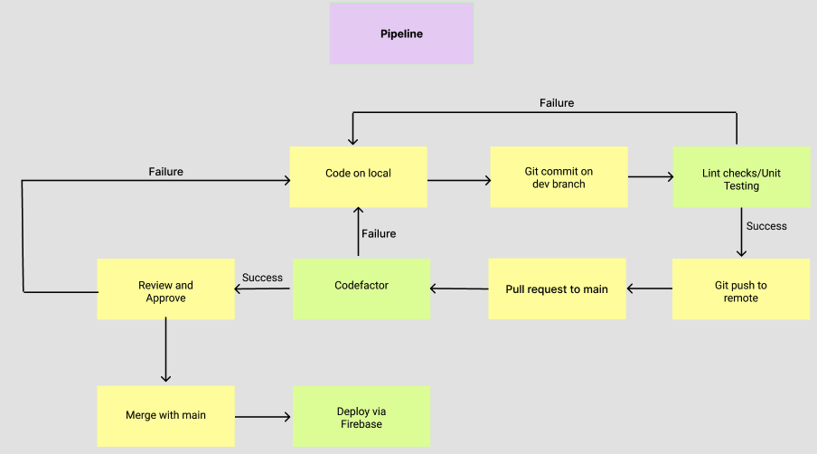

# Build Pipeline Phase 2 

---

## Grunt 
We are using Grunt in order to automate a variety of processes in the build pipeline, such as ESLint, JSDoc, and Jest.
 
The Gruntfile and package.json with all the necessary dependencies are included within the source directory. When running the Gruntfile it selects all .js files inside the directory `/source/assets/` and runs ESLint lint checking on all the files found. It also runs JSDoc automated documentation generation on these files. It also runs the shell command `npm run test` to execute Jest for unit testing.

### How to Set Up Grunt
1. Ensure that you have the latest version of `npm` installed by running `npm update -g npm` anywhere in your terminal
2. Install Grunt CLI by running `npm install -g grunt-cli`
3. Install ESLint CLI by running `npm install -g eslint`
4. Use `cd` to get back to the root directory (optional if you are already in the root directory)
5. Navigate to the source directory with `cd source`
6. Once you are in the source directory run `npm ci` to install all the dependencies in package.json
7. Congratulations, you've successfully set up grunt

### How to use Grunt
Using Grunt is very simple, once you are ready to autogenerate documentation, run lint checking, and run tests, just run the `grunt` command directly in terminal. It will let you know which Jest tests have passed/failed. It will also let you know if there are any lint-related errors with your JS code and generate the documentation. The documentation will be stored within the `source/doc` directory. In order to see the generated documentation go to `global.html` and use the LiveServer vscode extension in order to see the generated documentation.

If you encounter errors while running `grunt` due to ESLint errors/warnings, you can resolve those that are automatically fixable by running `eslint --fix assets/**/*.js` from the `source` directory.

---

## Linting (In CI/CD Pipeline)
We are using grunt in order to incorporate the linting process directly into the build pipeline. ESLint will be used for JS code style enforcement, all members of the team are expected to make sure that all JS code follows the linting guidelines before the commits are pushed into their respective branches. During a pull request the reviewer may also use the `grunt` command to make sure that style guidelines are followed before approving of the merge request. After running `grunt`, there should not be any warnings or errors in your terminal.

## Autogenerating Documentation 
We are using JSDoc in order to generate documentation. In order for JSDoc to work properly you must follow these guidelines:

1. All .js file are within `source/assets/`
2. Grunt must be installed and set up sucessfully (see above)
3. You must comment your code according to JSDoc guidelines linked [here](https://jsdoc.app/about-getting-started.html)

If all of the above steps are followed, then you can autogenerate the documentation for the webapp. In terms of team expectations, this is identical to the linting process described above. After you have developed your code on your local branch, you are expected to run `grunt` before pushing your changes to the remote branch. This is an important part of the build pipeline.

## Code Quality via Human Review (Pull Requests)
After you have finished making your changes locally, sucessfully passed the appropriate linting, documentation generation, and testing tasks using Grunt, you can push your changes to the remote branch. At this point, you can make a pull request. Pull requests have been set up to require manual review from one of your team members before anything can be merged into main. This is to ensure the code quality remains high. 

## Unit Tests
We are using Jest, which is a JavaScript testing framework, for unit testing. We also integrated this with Grunt, so running the `grunt` command will also run the unit tests.

## Code Quality via Tool
We are using CodeFactor, which is an automated code review tool for git. To see any issues with the code quality of our repository, visit this [link](https://www.codefactor.io/repository/github/cse110-fa21-group25/cse110-fa21-group25). CodeFactor will also run automatically whenever there is a pull request.

## Firebase Hosting
We are using Firebase Hosting, which is production-grade web content hosting for developers, to host our web app on the internet. Whenever a pull request is made, Firebase Hosting will generate a preview URL of what the web app would look like if the code was deployed. Once a branch is merged to main, then Firebase Hosting will deploy the code to the [URL](https://cse110-fa21-group25.web.app) where the web app is being hosted.
